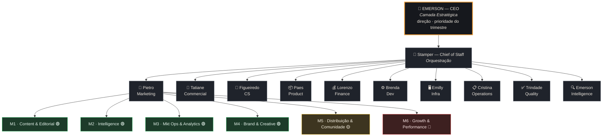
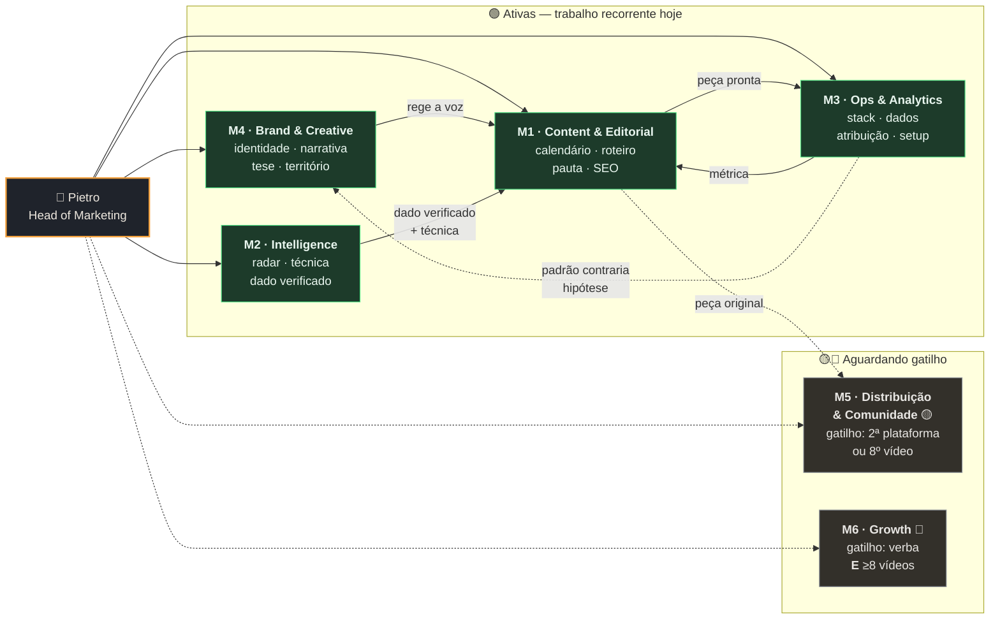
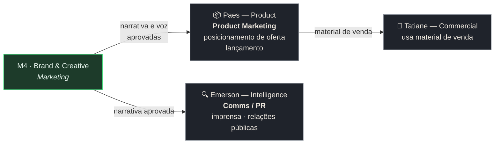

# Organograma HIVE — do CEO às divisões

> Criado 2026-08-25. Mapa completo das 3 camadas de administração.
> **Camada 1 — Estratégica:** Emerson (CEO) · **Camada 2 — Tática:** 11 Heads de squad · **Camada 3 — Operacional:** divisões dentro do squad.
> Cadeia de reporte: **divisão → Head → CEO**. Divisão nunca reporta direto ao CEO.

---

## Visão geral

**Legenda de status:** 🟢 ATIVA (trabalho recorrente) · 🟡 DORMENTE (definida, aguarda gatilho) · 🔴 CONGELADA (gatilho duplo)

---

## Camada 1 — Estratégica

| Papel | Quem | Decide |
|---|---|---|
| **CEO** | Emerson | Direção da empresa, prioridade do trimestre, o que entra e o que sai, aprovação de custo |
| **Chief of Staff** | Stamper | Não decide direção — **orquestra**: roteia assunto ao squad certo, agrega L1, rastreia loop aberto |

**Capacidade real:** 20h/semana. É a restrição que dimensiona todo o resto — ver `disponibilidade-emerson`.

---

## Camada 2 — Tática (11 squads)

| Squad | Head | Escopo | Divisões |
|---|---|---|---|
| `marketing/` | **Pietro** | Conteúdo, campanha, marca, social | **6** (ver abaixo) |
| `commercial/` | **Tatiane** | Lead gen, proposta, CRM, pipeline | — |
| `cs/` | **Figueiredo** | Onboarding, sucesso do cliente, suporte | — |
| `product/` | **Paes** | Roadmap, stories, priorização, **Product Marketing** | — |
| `finance/` | **Lorenzo** | DRE, faturamento, fluxo de caixa, orçamento | — |
| `dev/` | **Brenda** | Código, review, arquitetura, deploy | — |
| `infra/` | **Emilly** | VPS, monitoramento, CI/CD, segurança | — |
| `operations/` | **Cristina** | RH, cultura, metas, processos | — |
| `quality/` | **Trindade** | SOPs, auditoria, padrões | — |
| `intelligence/` | **Emerson** | Intel competitiva, pesquisa, **Comms/PR** | — |

**Só Marketing tem divisões hoje.** Condição para replicar: o squad precisa de volume real e recorrente em frentes que se bloqueiam por motivos diferentes. Nenhum outro atende hoje.

---

## Camada 3 — Operacional (divisões do Marketing)

### Detalhe das divisões

| # | Divisão | Equivalente de mercado | Status | Gatilho |
|---|---|---|---|---|
| **M1** | Content & Editorial | Content / Editorial | 🟢 | — |
| **M2** | Intelligence | Market / Competitive Intel | 🟢 | — |
| **M3** | Marketing Ops & Analytics | Marketing Ops & Analytics | 🟢 | — |
| **M4** | Brand & Creative | Brand & Creative | 🟢 | — |
| **M5** | Distribuição & Comunidade | Distribution + Community | 🟡 | 2ª plataforma publicando **ou** 8º vídeo / 100 inscritos |
| **M6** | Growth & Performance | Growth / Performance | 🔴 | Verba aprovada **E** ≥8 vídeos |

---

## Interfaces — funções de mercado que NÃO são do Marketing

Existem no organograma, mas o dono é outro squad. Evita dois donos para a mesma coisa.

| Função | Dono | Papel do Marketing |
|---|---|---|
| **Product Marketing** — posicionamento de oferta, lançamento, material de venda | **Product (Paes)** + Commercial (Tatiane) | M4 fornece narrativa e voz. **Não decide a oferta** |
| **Comms / PR** — imprensa, relações públicas, crise | **Intelligence (Emerson)** | M4 fornece narrativa aprovada. **Não conduz o relacionamento** |

⚠️ Demanda de posicionamento de oferta → rotear para **Paes**. Imprensa → rotear para **Intelligence**. Nunca duplicar no Marketing.

---

## Regras que governam o modelo

1. **Reporte sobe um nível por vez.** Divisão → Head → CEO. Divisão nunca fala direto com o CEO — isso esvaziaria a camada tática e multiplicaria os fluxos que chegam a quem tem 20h/semana.
2. **Divisão executa, Head prioriza, CEO decide direção.** Divisão não escolhe o que é prioridade.
3. **Dormente não custa.** Não gera tarefa, não entra em revisão de STATE, não recebe prefixo no L2.
4. **Anti-inchaço:** divisão 🟢 sem item no L2 por 30 dias é rebaixada a 🟡.
5. **Replicar divisões a outro squad** só quando houver volume real e recorrente em frentes que se bloqueiam por motivos distintos.
6. **Uma função, um dono.** Se duas caixas reivindicam a mesma coisa, uma delas está errada.

**Revisar o modelo:** meados de setembro/2026, depois do marco C2 (11/09).
